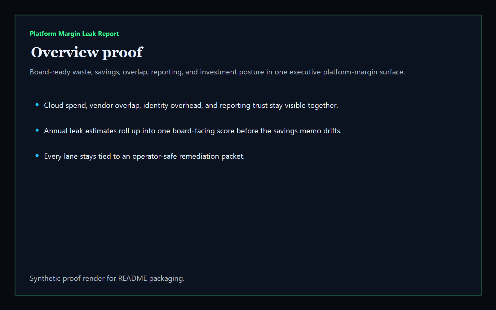
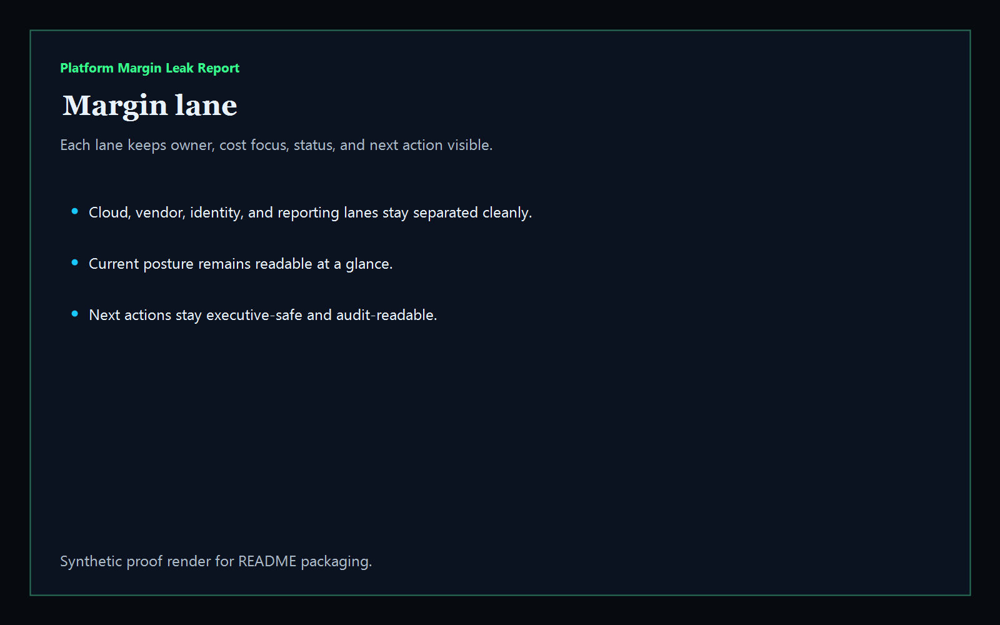
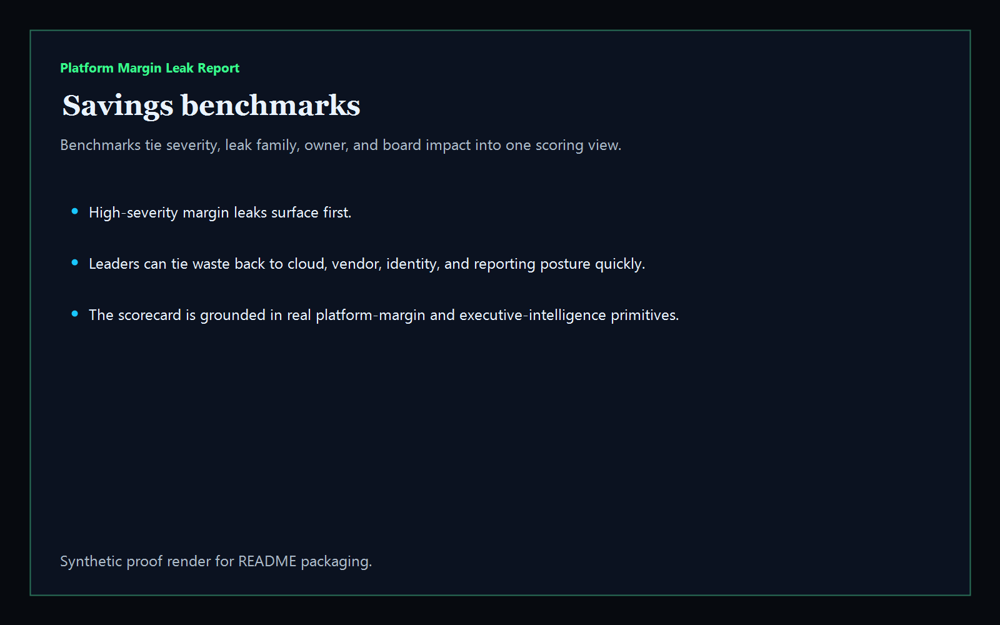
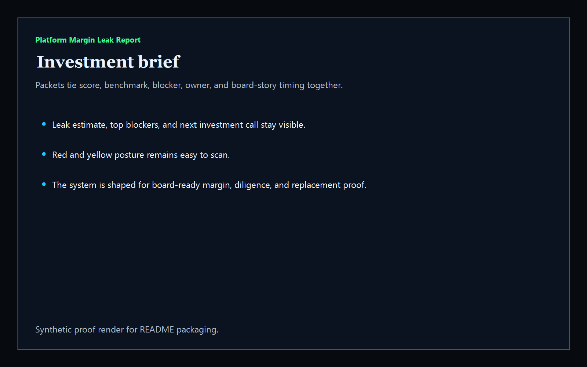

# Platform Margin Leak Report

[](https://github.com/mizcausevic-dev/platform-margin-leak-report/actions/workflows/ci.yml)
[](https://github.com/mizcausevic-dev/platform-margin-leak-report/actions/workflows/pages.yml)

Board-ready executive intelligence product for platform margin leakage. It turns synthetic margin packets into one scorecard covering cloud waste, duplicate-vendor overlap, identity operations overhead, release friction, support drag, reporting trust, and investment posture.

## What it does

- executive scorecard for platform waste, savings, investment priority, and board story
- margin lanes for cloud spend, vendor overlap, identity overhead, and reporting trust
- savings benchmark view for board-facing findings and owners
- investment brief packet view for diligence-ready executive summaries
- public synthetic control surface plus JSON APIs and CLI

## Product depth

Platform Margin Leak Report turns platform-cost frustration into a CFO-readable decision surface. It is designed for executives, operating partners, finance leaders, platform owners, RevOps leaders, and diligence teams that need to understand where cost is leaking, where savings can be captured, where investment is justified, and what story belongs in the board deck.

For non-technical readers, it answers: where are we wasting money, which platform lanes are driving margin drag, which owners need to act, and what can we say with confidence to the board or investors? For technical reviewers, it exposes a TypeScript library, CLI, Express routes, JSON APIs, synthetic fixtures, static Pages output, screenshots, tests, and validation commands that back the public narrative.

## What these repos have in common

This repo follows the Kinetic Gain control-plane pattern:

- name the operational ambiguity instead of hiding it inside screenshots or generic landing-page copy
- expose the decision surface as UI, JSON payloads, docs, screenshots, and validation commands
- connect GTM value, product narrative, technical proof, and executive review into the same public artifact
- keep public demos synthetic and safe while preserving enough structure to show how a real deployment would work

## Operating workflow

1. Load a synthetic platform-margin packet covering cloud waste, vendor overlap, identity overhead, release friction, support drag, and reporting trust.
2. Score the margin lanes and identify which findings materially affect savings, investment priority, and board narrative.
3. Generate benchmark, investment-brief, and verification views from the same underlying evidence.
4. Ship static public proof without exposing live billing, vendor, identity, or finance systems.

## Routes

- `/`
- `/margin-lane`
- `/savings-benchmarks`
- `/investment-brief`
- `/verification`
- `/docs`

## API

- `/api/dashboard/summary`
- `/api/margin-lane`
- `/api/savings-benchmarks`
- `/api/investment-brief`
- `/api/verification`
- `/api/sample`

## Why this matters (KG Embedded tie-back)

This repo is the board-intelligence shape of Kinetic Gain Embedded for platform economics. The same primitive can power executive scorecards, operating-partner diligence, portfolio benchmarking, and internal steering briefs without exposing live billing systems or write paths.

## Screenshots






## CLI

```powershell
npx platform-margin-leak-report .\fixtures\platform-margin-leak.json --format markdown
```

## Local run

```powershell
cd platform-margin-leak-report
npm install
npm run verify
npm run prerender
npm run render:assets
npm run start
```

Then open:

- [http://127.0.0.1:5532/](http://127.0.0.1:5532/)
- [http://127.0.0.1:5532/margin-lane](http://127.0.0.1:5532/margin-lane)
- [http://127.0.0.1:5532/savings-benchmarks](http://127.0.0.1:5532/savings-benchmarks)
- [http://127.0.0.1:5532/investment-brief](http://127.0.0.1:5532/investment-brief)

## Live

- [https://margin.kineticgain.com/](https://margin.kineticgain.com/)

This repo publishes synthetic sample platform-margin data only. It does not ship live finance credentials, vendor secrets, or authenticated write paths.
